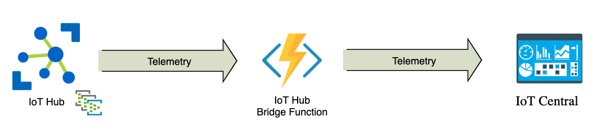
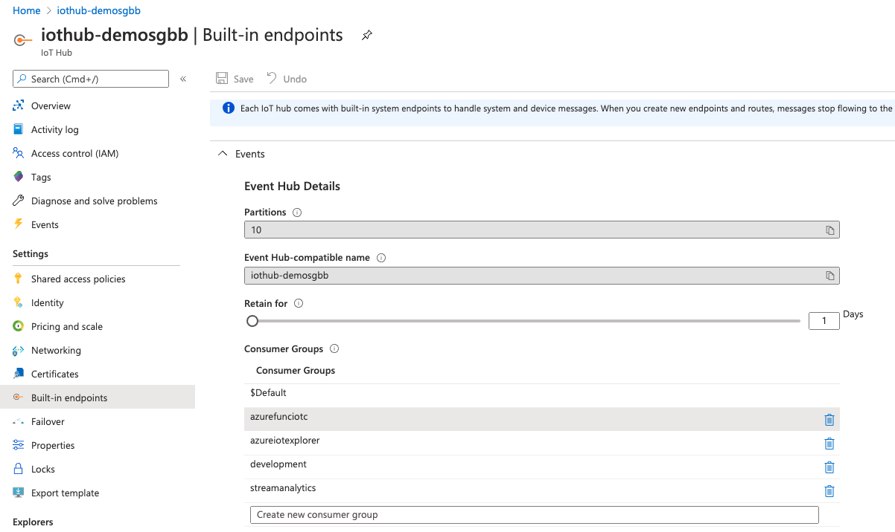

# iothub-bridge-function

This repo is based on [Azure IoT Central Device Bridge](https://github.com/Azure/iotc-device-bridge)

This repository contains everything you need to create an azure function that takes data from an iot hub and forwards it to IoT Central

## Instructions
Take the following steps to deploy an Azure Function into your subscription and set up the device bridge.

1. Click the `Deploy to Azure` button above. This opens up a custom ARM template in the Azure Portal to deploy the Azure Function.

2. Go to your IoT Central application, and navigate to the `Administration > Device Connection` area.
  - Copy the `ID Scope` and paste it into the `Scope ID` field the custom template. 
  - In the same page, under `Enrollment groups`, open the `SAS-IoT-Devices` group. In the group page, copy either the `Primary key` or the `Secondary key` and paste it into the `Iot Central SAS Key` field. (this key will be stored in a Key Vault
provisioned with the function).

  
  

## Important points
1. Function uses an IoT Hub consumer group called `azurefunciotc`, you must create it in order to function can get messages from IoT hub

